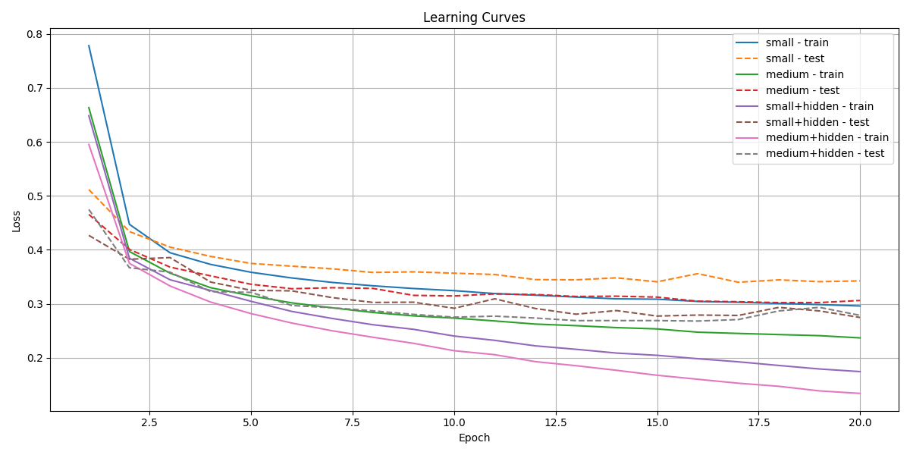

Assignment 1 : 





Assigment 2 : 
Mini Onderzoek : 

Assigment 3 / 4 : `

````
import torch
import torchvision
import numpy as np
import matplotlib
matplotlib.use('Agg')  # voorkomt fout in VS Code container zonder display
import matplotlib.pyplot as plt
import seaborn as sns
from torch import nn
from sklearn.metrics import confusion_matrix

# Verschillende CNN-modellen met kleine/grote netwerken en met/zonder hidden layer
class SmallCNN(nn.Module):
    def __init__(self):
        super().__init__()
        self.conv1 = nn.Conv2d(1, 4, 3, padding=1)
        self.pool = nn.MaxPool2d(2, 2)
        self.fc1 = nn.Linear(4 * 14 * 14, 10)

    def forward(self, x):
        x = self.pool(torch.relu(self.conv1(x)))
        x = x.view(-1, 4 * 14 * 14)
        return self.fc1(x)

class SimpleCNN(nn.Module):
    def __init__(self):
        super().__init__()
        self.conv1 = nn.Conv2d(1, 8, 3, padding=1)
        self.pool = nn.MaxPool2d(2, 2)
        self.fc1 = nn.Linear(8 * 14 * 14, 10)

    def forward(self, x):
        x = self.pool(torch.relu(self.conv1(x)))
        x = x.view(-1, 8 * 14 * 14)
        return self.fc1(x)

class SmallCNNv2(nn.Module):
    def __init__(self):
        super().__init__()
        self.conv1 = nn.Conv2d(1, 4, 3, padding=1)
        self.pool = nn.MaxPool2d(2, 2)
        self.fc1 = nn.Linear(4 * 14 * 14, 128)
        self.relu = nn.ReLU()
        self.fc2 = nn.Linear(128, 10)

    def forward(self, x):
        x = self.pool(torch.relu(self.conv1(x)))
        x = x.view(-1, 4 * 14 * 14)
        x = self.relu(self.fc1(x))
        return self.fc2(x)

class SimpleCNNv2(nn.Module):
    def __init__(self):
        super().__init__()
        self.conv1 = nn.Conv2d(1, 8, 3, padding=1)
        self.pool = nn.MaxPool2d(2, 2)
        self.fc1 = nn.Linear(8 * 14 * 14, 128)
        self.relu = nn.ReLU()
        self.fc2 = nn.Linear(128, 10)

    def forward(self, x):
        x = self.pool(torch.relu(self.conv1(x)))
        x = x.view(-1, 8 * 14 * 14)
        x = self.relu(self.fc1(x))
        return self.fc2(x)

# Data inladen en normaliseren
transform = torchvision.transforms.Compose([
    torchvision.transforms.ToTensor(),
    torchvision.transforms.Normalize((0.5,), (0.5,))
])

trainset = torchvision.datasets.MNIST(root="./data", train=True, download=True, transform=transform)
testset = torchvision.datasets.MNIST(root="./data", train=False, download=True, transform=transform)

trainloader = torch.utils.data.DataLoader(trainset, batch_size=256, shuffle=True)
testloader = torch.utils.data.DataLoader(testset, batch_size=1000, shuffle=False)

# Gebruik GPU als die beschikbaar is
device = torch.device("cuda" if torch.cuda.is_available() else "cpu")

# Functie om het model te trainen en test/train loss bij te houden
def train_and_evaluate(model, name, epochs=20):
    model.to(device)
    criterion = nn.CrossEntropyLoss()
    optimizer = torch.optim.Adam(model.parameters(), lr=0.001)

    train_loss, test_loss = [], []

    for epoch in range(epochs):
        model.train()
        total_train_loss = 0.0

        for images, labels in trainloader:
            images, labels = images.to(device), labels.to(device)
            optimizer.zero_grad()
            outputs = model(images)
            loss = criterion(outputs, labels)
            loss.backward()
            optimizer.step()
            total_train_loss += loss.item() * images.size(0)

        train_loss.append(total_train_loss / len(trainloader.dataset))

        # Testfase
        model.eval()
        total_test_loss = 0.0
        with torch.no_grad():
            for images, labels in testloader:
                images, labels = images.to(device), labels.to(device)
                outputs = model(images)
                loss = criterion(outputs, labels)
                total_test_loss += loss.item() * images.size(0)

        test_loss.append(total_test_loss / len(testloader.dataset))

        print(f"{name} - Epoch {epoch+1}/{epochs} | Train: {train_loss[-1]:.4f} | Test: {test_loss[-1]:.4f}")

    return model, train_loss, test_loss

# Resultaten evalueren + confusion matrix opslaan + 10 foute plaatjes tonen
def evaluate_and_show_results(model, name):
    model.eval()
    all_preds, all_labels, all_images = [], [], []

    with torch.no_grad():
        for images, labels in testloader:
            images, labels = images.to(device), labels.to(device)
            outputs = model(images)
            _, predicted = torch.max(outputs, 1)
            all_preds.extend(predicted.cpu().numpy())
            all_labels.extend(labels.cpu().numpy())
            all_images.extend(images.cpu())

    # Confusion matrix plotten
    cm = confusion_matrix(all_labels, all_preds)
    plt.figure(figsize=(8, 6))
    sns.heatmap(cm, annot=True, fmt="d", cmap="Blues")
    plt.title(f"Confusion Matrix - {name}")
    plt.xlabel("Predicted")
    plt.ylabel("True")
    plt.tight_layout()
    plt.savefig(f"confusion_matrix_{name}.png")
    plt.close()

    # Max 10 foute voorspellingen opslaan als plaatjes
    print(f"\nFoute voorspellingen - {name}:")
    shown = 0
    for i in range(len(all_preds)):
        if all_preds[i] != all_labels[i]:
            img = all_images[i].squeeze().numpy()
            plt.imshow(img, cmap='gray')
            plt.title(f"True: {all_labels[i]}, Pred: {all_preds[i]}")
            plt.axis('off')
            plt.tight_layout()
            plt.savefig(f"wrong_prediction_{name}_{shown}.png")
            plt.close()
            shown += 1
            if shown >= 10:
                break

# Leercurves plotten
def plot_learning_curves(results_dict):
    plt.figure(figsize=(12, 6))
    for name, data in results_dict.items():
        epochs = list(range(1, len(data["train_loss"]) + 1))
        plt.plot(epochs, data["train_loss"], label=f"{name} - train")
        plt.plot(epochs, data["test_loss"], linestyle='--', label=f"{name} - test")
    plt.title("Learning Curves")
    plt.xlabel("Epoch")
    plt.ylabel("Loss")
    plt.legend()
    plt.grid(True)
    plt.tight_layout()
    plt.savefig("learning_curves.png")
    plt.close()

# Modellen
models = {
    "small": SmallCNN(),
    "medium": SimpleCNN(),
    "small+hidden": SmallCNNv2(),
    "medium+hidden": SimpleCNNv2()
}

# Train en bewaar resultaten
results = {}
for name, model in models.items():
    trained_model, train_loss, test_loss = train_and_evaluate(model, name)
    results[name] = {
        "model": trained_model,
        "train_loss": train_loss,
        "test_loss": test_loss
    }

# Evaluatie: confusion matrix + fouten
for name, data in results.items():
    evaluate_and_show_results(data["model"], name)

plot_learning_curves(results)

'''
Modelstructuur
Ik heb drie basisversies van het netwerk gebouwd:

SmallCNN met 4 convolutionele filters

SimpleCNN met 8 filters

LargeCNN met 32 filters

Deze modellen bestaan uit één convolutionele laag, gevolgd door een poolinglaag, flattening, en een volledig verbonden laag van 10 outputs (voor de 10 cijferklassen).

Daarna heb ik van elk model ook een versie gemaakt met een extra verborgen laag van 128 neuronen, om te onderzoeken hoe dit de prestaties beïnvloedt. Deze nieuwe versies heb ik SmallCNNv2, SimpleCNNv2 en LargeCNNv2 genoemd.

Training en evaluatie
Alle modellen zijn 20 epochs getraind met de Adam-optimizer en CrossEntropyLoss. Tijdens de training heb ik zowel de train loss als de test loss bijgehouden, om later learning curves te kunnen plotten. Deze curves geven inzicht in hoe goed het model leert, en of er sprake is van overfitting.

Daarnaast heb ik per model een confusion matrix laten genereren om te zien waar het model fouten maakt. Ook heb ik van elk model tien fout geclassificeerde voorbeelden opgeslagen als afbeeldingen, zodat ik de aard van de fouten kon analyseren.

Resultaten en observaties
SmallCNN had het minste aantal parameters, leerde stabiel, maar had lagere nauwkeurigheid.

LargeCNN leerde snel en had hoge nauwkeurigheid, maar vertoonde sneller overfitting.

De modellen met een extra verborgen laag (de v2-versies) presteerden over het algemeen beter dan de basisversies, met name in het geval van SimpleCNNv2. De extra laag hielp om complexere patronen te leren zonder direct overfit te raken.

Op basis van de learning curves zag ik duidelijk wanneer overfitting begon: de training loss bleef dalen, maar de test loss liep op. De SimpleCNNv2 bood in veel gevallen het beste compromis tussen nauwkeurigheid en generalisatie.
'''
````